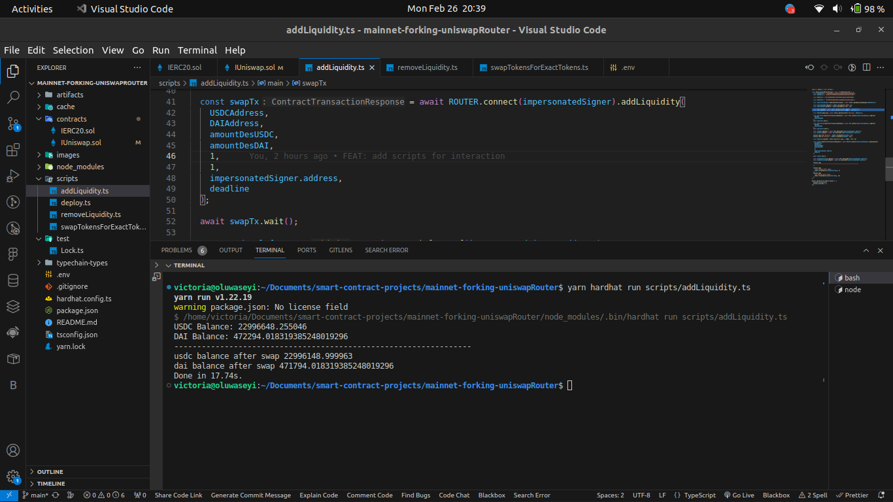

# Mainnet Forking - Interaction with Uniswap

```shell
yarn install

yarn hardhat compile

```

Interacted with 2 UNISWAP Functions

### Add Liquidity

```shell
yarn hardhat run scripts/addLiquidity.ts

```



### swapTokensForExactTokens

```shell
yarn hardhat run scripts/swapTokensForExactTokens.ts

```


